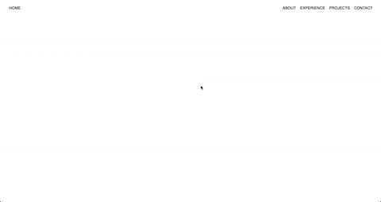

# Personal website 👨‍💻

This is the code behind my personal website, built from the ground up using React. You can visit it by [clicking here](https://jason-wong.netlify.com/)!

<div align="center"></div>

[Objective](#Objective) | [Running the program](#running_the_program) | [Further work](#further_work)

## Objective

Build a website to apply the things I have learnt in React, and give a snapshot of my developer profile.

## <a name="running_the_program">Running the program</a>

If you wish to run this on your local host and customise it, you can use the following steps.

### Setup
```
$ git clone https://github.com/jasylwong/my_website.git
$ cd my_website
$ npm install
$ npm start
```

## <a name="further_work">Further work</a>

- Make the website more responsive, to deal better with being
visited on a wider range of devices
- Include a more dynamic landing page
- Add a 'Collaboration' page, to share the work of some of my
very talented photographer/artist/dev friends
- Add a contact form on the 'Contact' page
- Add more projects, both those already completed and those created in the future.
- Add a footer to each page


